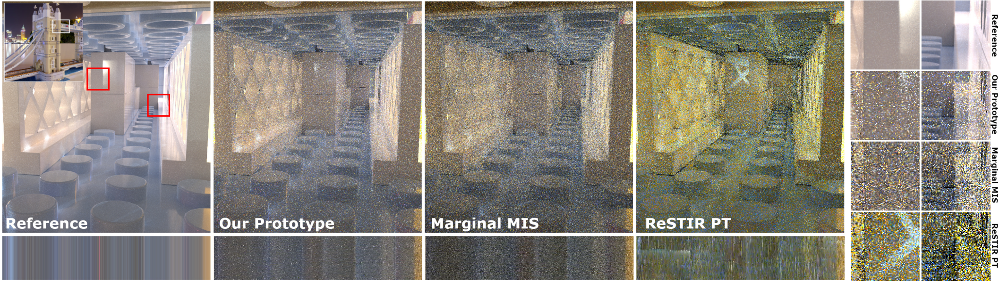

# Conditional ReSTIR Prototype

## Introduction
- This repo includes source code for the following SIGGRAPH Asia 2023 paper

> **Conditional Resampled Importance Sampling and ReSTIR** 
> Markus Kettunen* (NVIDIA), Daqi Lin* (NVIDIA), Ravi Ramamoorthi (NVIDIA and UC San Diego), Thomas Bashford-Rogers (University of Warwick),  Chris Wyman (NVIDIA) 
> (*Joint first authors)  

This prototype application of conditional ReSTIR defers ReSTIR-based path reuse by one or more bounces. It is based on conditional resampled importance sampling (CRIS) theory, an extension of GRIS [[Lin et al. 2022]](https://research.nvidia.com/publication/2022-07_generalized-resampled-importance-sampling-foundations-restir) to conditional path spaces that enables reusing subpaths from unidirectional-sampled paths with correct unbiased contribution weights. Our conditional ReSTIR prototype modifies ReSTIR PT [[Lin et al. 2022]](https://github.com/DQLin/ReSTIR_PT) with a final gather pass. As in photon mapping, such a final gather reduces blotchy artifacts from sample correlation.

- The method is implemented as a rendering component called "ConditionalReSTIR" (`Source/Falcor/Rendering/ConditionalReSTIR`) in Falcor 5.2.
See [README_Falcor.md](README_Falcor.md) for the original README file provided by Falcor.
- A script `runConditionalReSTIRDemo.bat` is provided to show how the method works VeachAjar scene (from [Benedikt Bitterli's rendering resources](https://benedikt-bitterli.me/resources/)) which is contained in the repo.
- Before running the scripts, you need to compile the program and download the scene files following the instruction below.

## Licensing

The new conditional resampling code in this repository is [licensed](LICENSE.md) under the NVIDIA Source Code License.  Included NVIDIA dependencies remain licensed under their existing licenses, including:  [Falcor](https://github.com/NVIDIAGameWorks/Falcor/blob/master/LICENSE.md), [DLSS](https://github.com/NVIDIA/DLSS/blob/main/LICENSE.txt), [RTXGI](https://github.com/NVIDIAGameWorks/RTXGI/blob/main/License.txt), [RTXDI](https://github.com/NVIDIAGameWorks/RTXDI/blob/main/LICENSE.txt), and [NRD](https://github.com/NVIDIAGameWorks/RayTracingDenoiser/blob/master/LICENSE.txt).  

Falcor also downloads various 3rd party dependencies as git submodules; these have their own licenses.

## Prerequisites
- Windows 10 version 20H2 or newer
- Visual Studio 2022
- [Windows 10 SDK version 10.0.19041.1 Or Newer](https://developer.microsoft.com/en-us/windows/downloads/sdk-archive)
- We relied on NVIDIA drivers 530.xx and above 
	* Though our baseline Falcor only requires NVIDIA driver 466.11 or later
- A GPU supporting DirectX Raytracing 
	* Conditional ReSTIR is very costly; we recommend a NVIDIA GeForce RTX 4090 if planning to play with settings much

## How to compile
IMPORTANT:  We use git submodules to download dependencies!  Downloading the git repository as a .zip (rather than using `git clone`) will ensure you lack required dependencies, and the build scripts will fail.

After cloning the repository:
- Run `setup_vs2022.bat`
- Open `build/windows-vs2022/Falcor.sln` and the `Build Solution` in the `Release` configuration 

## Run the demo
- Execute `runConditionalReSTIRDemo.bat`
- The GUI contains self-explanatory settings for parameter tweaking under "Rendering Presets".  
- Not all exposed options under other, more advanced, menus work together in all configurations (e.g., at least Falcor's existing path tracing "Russian roulette" toggle is known buggy).

## Testing with more scenes
To run our code more generally requires:
- Running the executable `build/windows-vs2022/bin/Release/Mogwai.exe`
- Loading the conditional ReSTIR render script `scripts/ConditionalReSTIR.py`.  Options include:
	* Drag and drop the script into a running Mogwai instance 
	* Load via a Mogwai menu (File -> Load Script), or 
	* Pass to Mogwai as an command line parameter (as in `runConditionalReSTIRDemo.bat`)
- Loading a scene:
	* The last line of the `ConditionalReSTIR.py` script already does this
	* Modify this line, if desired, or delete it and load the scene explicity via drag-and-drop or the Mogwai menus.

Mogwai can load a variety of [scene types](docs/usage/scene-formats.md):
- Falcor's native `.pyscene` format ([more details](docs/usage/scene-formats.md)). 
- Some simplistic `.usd` files (support is largely experimental).
- FBX files and GLTF files via the included [Assimp](https://github.com/assimp/assimp) module.
	* Many of these lack emissive light surfaces, which are important for ReSTIR renderers.
	* Often we wrap these in a .pyscene file so we can modify material emissive properites via Python on load.
- Many PBRT v4 files:
	* E.g., from [Benedikt's resources](https://benedikt-bitterli.me/resources/) page
	* Though not all materials match with PBRT.

